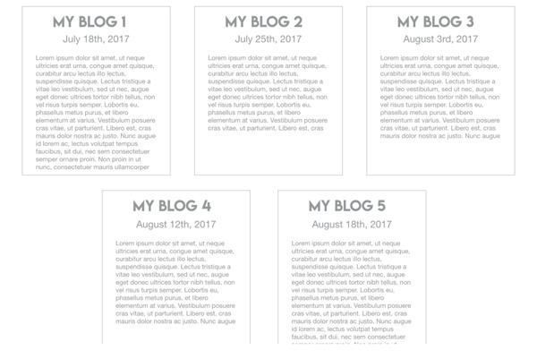

# daviddassau.github.io

# My Personal Site
### This project can be view at [daviddassau.github.io](https://daviddassau.github.io)

##### Part 1 Requirements
> Basically an HTML version of your resume.

1. Each place you've worked must be contained in an article element.
1. Each article element should have a header that contains the name of the company and the dates of your employment.
1. Each article should contain at least one section that describes your position there.
1. No footer required for these articles.
1. Contact information page
> One article.
1. A heading (e.g. "How to contact me").
1. Four sections that contain an email address, GitHub link and two social media URLs. (Bonus points if you use images to link to each of these).
Common page elements

> Navigation

* Create a navigation bar on each page that contains a link to both pages. You can use whatever elements you like for the navigation, but it must be contained in the appropriate HTML5 semantic element.

> Page header

* Each page should have an `<h1>` title contained in the appropriate HTML5 semantic tag.

> Page footer

* Each page should have the same footer information. Put whatever information you like in the footer.

##### Part 2 Requirements
> Create 2 new HTML pages: 
1. Projects and About Me
2. Add links to these 2 new pages to your existing navigation bar.
> Update your navigation bar with the following interactivity.
1. When the user hovers over one of the links, the color of the text should change.
1. When the user hovers over one of the links, the background color of the element that contains the link should change.
1. When the user clicks on one of the links, the element that contains the link should grow in size by 5px on the left and right.

##### Part 3 Requirements
1. Create 1 new HTML page: Blog
1. Add a link to this blog page in your existing navigation.
1. Create at least 5 blog entry "cards" for now. Each card should have:
	* A header section containing an H4 title and the date the blog was written.
A content section containing your body of text. These entries should be themed around your journey into development. As you discover new tricks, tips and tools, write about your discovery. Write about what you have tried and why it did or did not work. These entries will be helpful for you as you speak with other members of the development community (and will be helpful when you are frustrated - look how far you've come). For now, you can use placeholder text, but this should be your place to continue writing throughout this course.
Your page should follow this mockup. Use Flexbox to achieve this:

##### Part 4 Requirements

##### Part 5 Requirements
